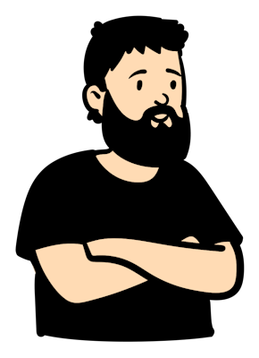
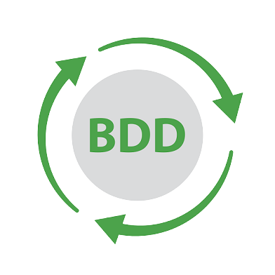

 

Atualmente sou estudante de Análise e Desenvolvimento de Sistemas, com uma paixão pela qualidade de software e desenvolvimento frontend. Tenho me aprofundado em ambas as áreas, combinando meu conhecimento em QA com minhas habilidades em desenvolvimento web.

No mundo da Garantia de Qualidade (QA), sou especializado na criação de Casos de Teste detalhados, Planos de Teste abrangentes, Matrizes de Rastreabilidade precisas e Checklists de Teste minuciosos. Utilizo minhas habilidades em automação de testes com ferramentas como RobotFramework, Playwright, K6 e Cypress para garantir a eficiência e a confiabilidade dos processos de teste.

Além disso, sou apaixonado pelo desenvolvimento frontend e tenho me aventurado em HTML, CSS e JavaScript, além de frameworks modernos como React e Next.js. Essa combinação me permite não apenas testar, mas também contribuir para a construção de interfaces de usuário impressionantes e responsivas.

<h3 align="left">Vamos nos conectar!</h3>

  
  
  
  
  
  
  
  
  
  

<h3 align="left">Minhas habilidades</h3>

 
  
  
  
  
  
  
  
  
  
  
  
  
  
  
  
  
  
  
  
  

<h3 align="left">GitHub Status</h3>

  <a href="https://github.com/vitor-moratz">
  
  
  
  

 

  

  

 
 
  - Badges by <a href="https://shields.io/">shields.io</a>.
  - GitHub Stats by <a href="https://github.com/anuraghazra/github-readme-stats">anuraghazra</a>.
  - Developer vector created by @andi_aqua_ on <a href="https://picrew.me/en/">picrew</a>.
 
  
Made with 💚 by <a href="https://github.com/vitor-moratz">vitor-moratz</a>.

